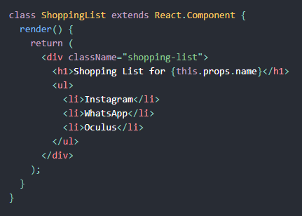

# React로 만드는 Tic Tac Toe
> :bulb: React 공식 홈페이지의 튜토리얼에 따라서 코딩을 해봄으로써 기본적인 CRUD 기능 구현을 익힘

## 목표
- 틱 택 토 구현하며 학습한 내용 정리
- 소스코드 완성

## 학습한 내용 정리
- React란? : 

  사용자 인터페이스를 구축하기 위한 선언적이고 효율적이며 유연한 JavaScript 라이브러리. “컴포넌트”라고 불리는 작고 고립된 코드의 파편을 이용하여 복잡한 UI를 구성하도록 도움.

  예제)

- ### JSX

  - JSX? : 자바스크립트 확장 문법이고, xml과 유사함.
  - JS코드내의 UI 작업을 할 때 특히나 가독성 부분에서 유용함. (리액트에서 많이 사용)

- React 컴포넌트는 캡슐화되어 독립적으로 동작할 수 있음. 이러한 이유로 단순한 컴포넌트를 사용하여 복잡한 UI를 구현할 수 있음.

- Props를 통해 컴포넌트 간에 데이터 전달

- 컴포넌트에서 State를 활용하여 특정 값을 기억시키고 활용

- Vue와 마찬가지로 React Devtools 확장 프로그램을 통해 구조 파악 가능

- 이벤트 리스너 js처럼 활용 가능

- 함수 컴포넌트를 활용하여 보다 간단하게 컴포넌트 작성. - state 없이 render 함수만을 가지고, `React.Component`를 확장하는 클래스를 정의하는 대신 `props`를 입력받아서 렌더링할 대상을 반환하는 함수를 작성할 수 있음.

- 동적인 리스트를 만들 때에는 키를 할당해줌. 인덱스 값을 키로 사용하는것은 아이템간의 순서를 바꾸거나 아이템의 추가/제거 시 문제가 생길 수 있기 때문.

## 게임 완성
- 9개 칸 각각에서 state관리하는 것보다 뷰처럼 부모 컴포넌트에서 게임의 상태를 저장하고 각 칸에 숫자를 넘겨줄 때와 같은 상황에서 각 Square에 prop을 전달하는 식으로 작성

  (부모 컴포넌트에 공유 state를 정의하여 부모 컴포넌트에서 props를 사용하여 자식 컴포넌트에 state를 다시 전달할 수 있도록 하여 부모 - 자식 컴포넌트간의 동기화 진행)

- 순서 바꾸기 기능 + 이전 차례로 시간을 되돌리는 기능 추가

- 

## 참고자료
- https://ko.reactjs.org/tutorial/tutorial.html

## 과제제출
- [기본과제](기본과제)
- [심화과제](심화과제)
