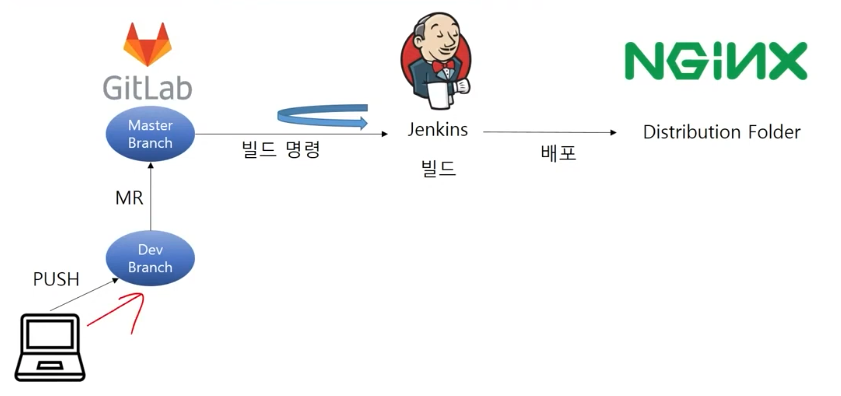

# Jenkins + docker를 활용한 CI/CD구축
> :bulb: Docker로 jenkins이미지을 간편하게 설치하고 gitlab에 연동해 CI/CD 환경을 구축해 본다.

## 목표
- Jenkins로 CICD 환경을 구축하여 프로젝트 배포를 지속적으로 쉽게 할 수 있다.
- Docker로 Jenkins를 설치하고 설정할 수 있다.
- 싸피랩 이하 Gitlab과 Jenkins를 연동할 수 있다.
- 웹서버(Nginx) 설치 후 설정을 하고 어플리케이션을 배포할 수 있다.

## Docker 
- 도커란 리눅스 컨테이너를 기반으로 하여 특정한 서비스를 패키징하고 배포하는데 유용한 오픈소스 프로그램
- 중요한 개념은 **컨테이너**

### 1. 가상머신과 도커 컨테이너

- 만약 윈도우에서 리눅스를 쓴다면, 몇 가지 방법이 있다.
  - 가상머신은 하이퍼바이저를 이용해 Guest OS를 만들어낸다.
  - 윈도우는 Host OS, 우분투는 Guest OS가 되는 것
  - Host OS와 Guest OS 둘 다 자원을 잡아먹으므로 성능이 저하된다.
- 도커의 컨테이너는 살짝 다르다.
  - 가상머신에 비해 **꼭 필요한 것만 담겨서 구동**한다는 차이가 있다.
  - 컨테이너에 필요한 커널은 호스트의 커널과 공유해서 사용하고, 컨테이너 안에는 애플리케이션을 구동하는데 필요한 라이브러리 및 실행파일만 존재하기 때문이다.
  - 그래서 컨테이너를 이미지로 만들 경우 용량이 대폭 줄어든다.

### 2. 도커의 장점

- 애플리케이션의 **독립성**
  - 호스트 OS와도, 다른 컨테이너와도 독립된 공간을 보장받을 수 있기 때문에 충돌 발생 염려가 전혀 없다.
- 컨테이너 내부에 작업을 한 후에 **배포**하려고 한다면 도커 이미지라는 패키지로 만들어서 운영서버에 전달만 하면된다. -> 배포가 쉽다.
- 모놀리식 애플리케이션 방식에서 마이크로서비스 구조로 변화가 쉽다.
  - 즉, 컨테이너 하나당 하나의 기능만을 제공하는 모듈로 만들어서 부하가 많은 모듈은 여러개 더 만들고 하는 조정이 가능해진다.

## Jenkins
- 소프트웨어 개발 시 지속적으로 통합 서비스를 제공하는 툴
- CI(Continuous Intergration)이라고도 표현
- 다수의 개발자들이 하나의 프로그램을 개발할 때 버전 충돌을 방지하기 위해 각자 작업한 내용을 공유역역에 잇는 저장소에 빈번히 업로드함으로써 지속적 통합이 가능하도록 해준다.

### 1. 젠킨스의 장점

- 개발중인 프로젝트에서 커밋은 매우 빈번히 일어나기 때문에 커밋 횟수만큼 빌드를 실행하는 것이 아니라 작업이 큐잉되어 자신이 실행될 차례를 기다리게 된다
- 코드의 변경과 함께 이뤄지는 이 같은 자동화된 빌드와 테스트 작업들은 다음과 같은 이점들을 가져다 준다.
  - 프로젝트 표준 컴파일 환경에서의 컴파일 오류 검출
  - 자동화 테스트 수행
  - 정적 코드 분석에 의한 코딩 규약 준수여부 체크
  - 프로파일링 툴을 이용한 소스 변경에 따른 성능 변화 감시
  - 결합 테스트 환경에 대한 배포작업

## 참고자료
- https://velog.io/@ckstn0777/%EB%8F%84%EC%BB%A4%EB%9E%80-%EB%AC%B4%EC%97%87%EC%9D%B8%EA%B0%80

- https://ict-nroo.tistory.com/31

## 과제제출
- [기본과제](기본과제)
- [심화과제](심화과제)