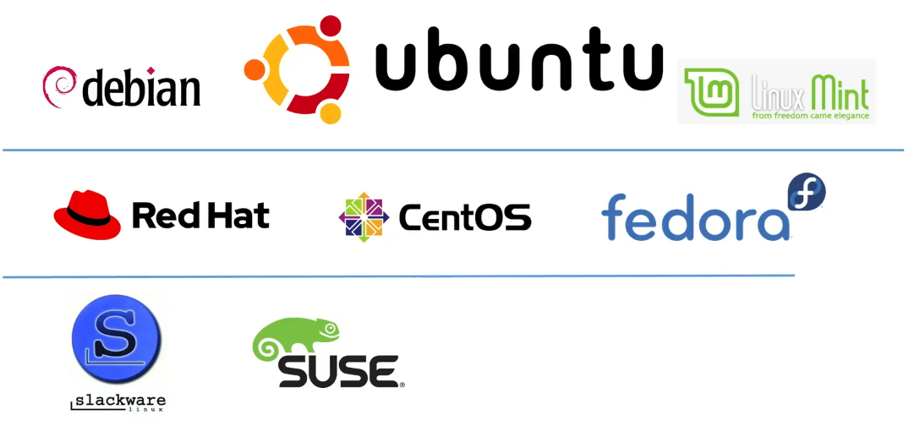

# Linux 머신 구하기
> :bulb: 클라우드 서비스 혹은 WSL2로 리눅스 환경 확보, Docker Setup 등을 실습해보면서 2학기 프로젝트의 인프라 및 클라우드 서비스 이해하기

## 목표
- 리눅스 환경을 이해하고 리눅스 머신 종류에 대해 이해하기

## 리눅스란?
- 개발자의 OS
- 서버용으로 많이 활용
- 무료 오픈소스

## 리눅스의 범위

- **HW(CPU, RAM) + 커널** + 쉘(csh, bash) + 응용프로그램(vi에디터, x윈도우)
  - **굵은 글씨** : 리눅스
  - 보통 글씨 : 리눅스가 동작하는 내용을 보기 위해서, GUI 환경으로 볼 수 있는 창구 역할의 쉘

### 리눅스 배포판 (Linux Distro)

> 대표적으로 3가지 계열 존재

- 슬랙웨어 계열은 대중적으로 사용하지 않는다고 함
- 배포판마다 조금씩 차이는 있으나 커널은 동일한 것을 사용
- 배포판 중에는 유로도 존재하며 각각의 특색이 존재
- 이 중 우분투를 처음 접해보고자 함
  - 우분투의 짝수해의 4월 버전을 **LTS(Long Term Support)**라고 칭함
  - 보안, 버그 수정 등 장기간(5년) 업데이트가 지원되는 버전

## 리눅스 머신 구하기

- 리눅스 서버를 구하려면 **리눅스 OS를 설치 혹은 설치된 머신**을 구하면 됨
- 대표적인 방법 4가지

### 1. PC에 우분투 설치

- 기존에 깔려있던 윈도우를 밀고 우분투를 처음부터 설치
- 하지만 다음의 문제가 발생
  - 일상에 윈도우 PC가 필요할 경우 사용하지 못하게 됨
  - PC 부품이 지원여부(호환성) 문제가 감당한지의 여부
- 듀얼부팅이란 기능을 통해 윈도우 + 리눅스 즉, OS를 2개 설치하는 방법도 가능
  - 이또한 부품 호환성이 자주 문제가 됨

### 2. WSL2

- 윈도우10을 사용하고 있는 환경일 때, 몇가지 설정만으로 윈도우 내에서 하나의 작은 시스템으로 WSL(Windows Subsystem for Linux)을 사용 할 수 있음
- 호환성이 높고 리눅스 학습에 있어서 문제가 거의 없음

### 3. 가상머신

- 애뮬레이터와 같은 개념
- PC에서 소프트웨어 적으로 컴퓨터를 만들고 거기에 리눅스 OS를 설치하는 방식
- 속도에 불이익이 많고 많은 버그의 발생이 잦음

### 4. 클라우드

- 가장 보편적이고 대중화된 방식
- AWS 등의 클라우드 기술을 활용한 서비스를 활용해 리눅스 서버 인스턴스를 사용할 수 있음

## 참고자료

## 과제제출
- [기본과제](기본과제)

