# 산출물
> 환경에 맞는 리눅스 머신을 설치

## AWS EC2를 활용한 리눅스 서버 구축하기

### 1. 리눅스 서버 구축 과정

#### A. EC2 인스턴스 생성하기

- 우측 상단의 Region을 **아시아 태평양(서울)**로 지정

  - 물리적으로 가까워야 속도가 빠르기 때문

  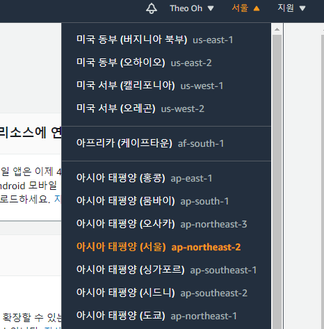

  

- EC2 항목을 누른 후 **인스턴스 시작** 버튼

  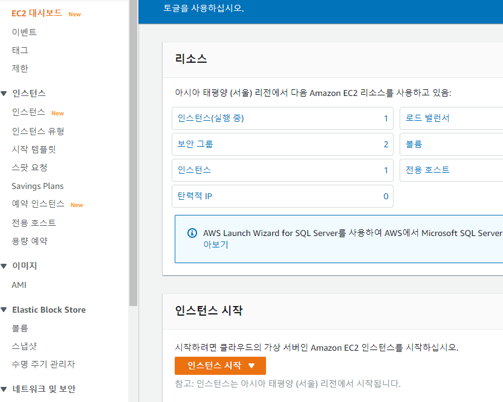

  

- Amazon Machine Image(AMI) 선택

  - 인스턴스를 시작하는데 필요한 소프트웨어 구성 단계
  - 아마존 리눅스 2, 우분투 서버 20.04, SUSE, 레드 햇 등등 존재

  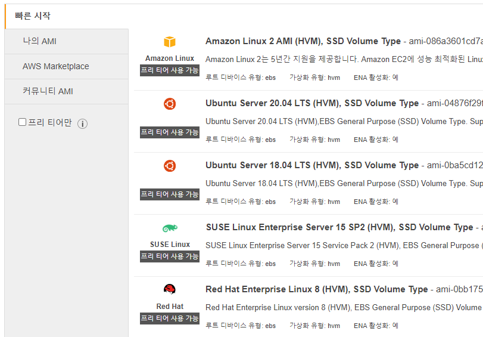

  

- **Ubuntu Server 20.04** 선택

- 인스턴스 유형으로 프리티어 사용 가능한 **t2.micro** 선택

  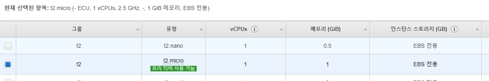

  

- 보안 그룹은 따로 설정하지 않는다.

  - 추후에 보안 그룹은 설정하여 특정 IP 주소에서만 접근 가능하도록 열 수 있음
  - 현재 진행하는 프로젝트는 실습이기 때문에 크게 문제없으므로 진행

  

  

- 진행하다보면 **키 설정** 창이 뜰 것이다.

  - 키를 가지고 있어야 나중에 원격으로 접근이 가능
  - 처음에는 키가 없기 때문에 새키를 발급  받고, 간단한 단어로 key pair에 입력한다.
  - 이 때, 다운로드 되는 `.pem` 파일이 저장되는 것을 확인한다.

  

  

- 이제 하나의 새로운 리눅스 인스턴스가 생성되고 있다.

  

  - 약 10분 후 인스턴스가 완료 될 것이다.

    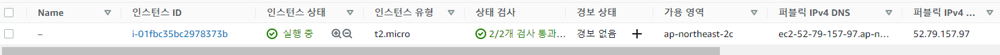

    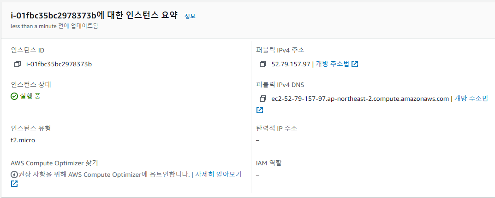

### 2. Windows에서 Linux 인스턴스 연결하기

> PuTTY 설치 및 pkk파일 만들기

- 인스턴스의 상태가 **실행 중**인 것을 확인하고 다음 과정을 이어 가고자 한다.
- 먼저 로컬 컴퓨터에 PuTTY를 설치해야 한다.
  - https://www.chiark.greenend.org.uk/~sgtatham/putty/latest.html
  - PuTTY 이미 설치되어 있어도 최신 버전으로 설치하는 것을 권장한다고 한다.
  - PuTTY는 리눅스나 유닉스 계열의 서버에 원격으로 접속할 수 있는 클라이언트 프로그램이라고 한다.
  - 우리가 현재 사용하는 목적은 윈도우에서 리눅스로 SSH 프로토콜을 이용하여 접속하기 위해 사용하는 것이다.
    - SSH(Secure SHell, 시큐어 셀) : 네트워크 상의 다른 컴퓨터에 로그인하거나 원격 시스템에서 명령을 실행하고 다른 시스템으로 파일을 복사할 수 있도록 해 주는 응용 프로그램 또는 그 프로토콜을 의미

- 설치가 완료되면 다음과 같은 창으로 퍼티를 실행시킬 수 있다.

  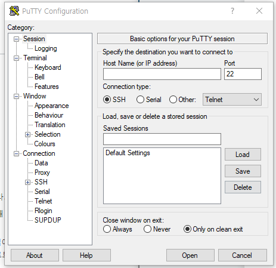

- 또한 위에서 다운 받은 키 (`.pem`)파일을 `.ppk` 파일로 변환 시켜줄 PuTTYgen도 다운받아 준다.

  - 푸티로 접속하기 위해서는 서버생성시 받은 키페어를 푸티용으로 변환시켜줘야 하기 때문

    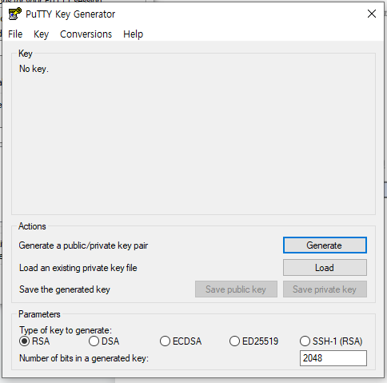

- **Conversions** 탭의 **Import key** 항목으로 이동해서 다운받은 `.pem` 파일을 선택한다.

  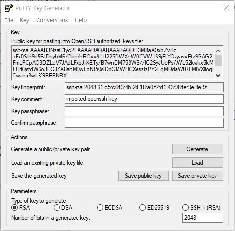

- **Save private key**를 선택하고 암호없이 키 저장에 대한 경고가 나오지만, **예**를 눌러 진행한다.

  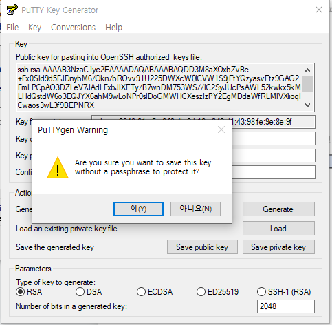

- 이제 변환 받은 키를 사용해서 푸티로 서버에 접속하고자 한다.

  - 진행하기에 앞서 만들었던 인스턴스의 퍼블릭 IP를 알아야 한다.

    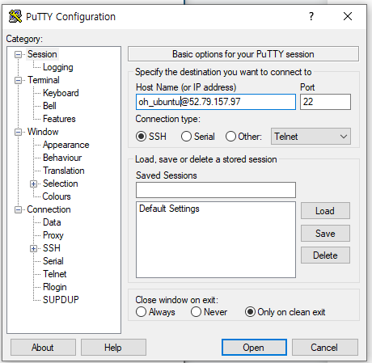

  - Host Name에 **ubuntu@Public DNS**를 입력한다.

    - **oh_ubuntu**처럼 맘대로 입력하는게 아닌!!!! **ubuntu**이여야만한다!!!!
    - AMI에 적합한 사용자 이름으로 연결해야 권한 에러 없이 연결된다!

- **Connection** 탭의 **Auth** 탭으로 이동해 **Browse** 버튼을 클릭하여 생성한 `.ppk` 파일을 선택한다.

  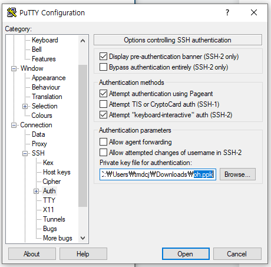

- Open을 클릭한다.

  - 이 인스턴스를 처음 연결하는 경우 PuTTY에서 연결하려는 호스트를 신뢰할 수 있는지 물어보는 알림 상자가 표시된다.

  - 예를 선택하면 창이 열리고 인스턴스에 연결된다.

    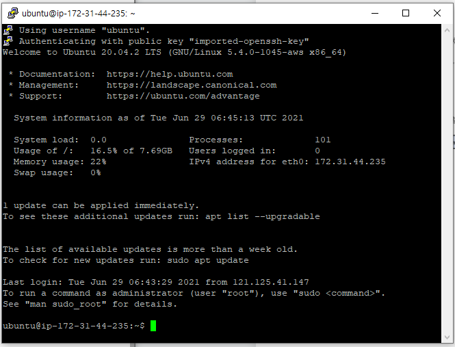

## 참고 자료

- https://luji.tistory.com/6
- https://docs.aws.amazon.com/ko_kr/AWSEC2/latest/UserGuide/putty.html
- https://ko.wikipedia.org/wiki/%EC%8B%9C%ED%81%90%EC%96%B4_%EC%85%B8

