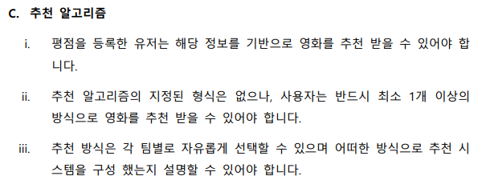

# 기획 & 요구사항 정의

- 진행했던 프로젝트의 **추천 알고리즘**에 대한 기존 요구사항은 다음과 같다.

- 해당 프로젝트를 개발하면서 **내가 구현한 추천 알고리즘**을 기반으로 한 요구사항을 새롭게 정의하고자 한다.

---

### C. 추천 알고리즘

1. 로그인 사용자에게만 추천 영화 서비스를 제공합니다.
2. 사용자가 ':heart:' 버튼을 누른 영화를 기반으로 추천 영화 서비스를 제공합니다.
   - 사용자가 ':heart:' 버튼을 누른 영화가 없다면 **'Recommendation'** 페이지에서 영화를 인기영화를 추천해줍니다.
   - 추천 인기영화 중 사용자가 선택한 영화를 기반으로 추천 영화 리스트를 다시 제공해야 합니다.
3. 추천 영화 리스트는 **IMDB API**의 **MOVIES** 카테고리 중 **Get Similar Movies** 의 API를 활용합니다.
4. API를 통해 응답받은 추천 영화 리스트는 **'Recommendation'** 페이지에 보여질 수 있도록 합니다.
   - API를 통해 응답받은 추천 영화 리스트가 충분하지 않다면, 사용자에게 인기영화를 추천하고, 선택된 영화를 기반으로 추천 영화 리스트를 다시 제공합니다.

### D. '좋아요' 영화 리스트

1. 로그인 사용자에게만 제공되는 페이지 입니다.
2. 사용자가 영화 상세 정보 모달 창에서 ':heart:' 버튼을 눌렀을 때, ':heart:' 버튼이 눌린 영화들을 모아서 보여주는 페이지 입니다.
   - 로그인 하지 않은 사용자일 때, 로그인 창으로 연결됩니다.
3. '좋아요' 영화 리스트 페이지 내부에서 ':heart:' 버튼을 다시 누르면, 빈 하트로 돌아가고 해당 페이지 목록에서 제거됩니다.
   - 영화 리스트를 보여주는 컴포넌트가 비동기적으로 작동해야하며, 페이지 전체 새로고침을 통해 목록에서 제거하도록 구현하지 않도록 합니다. 

