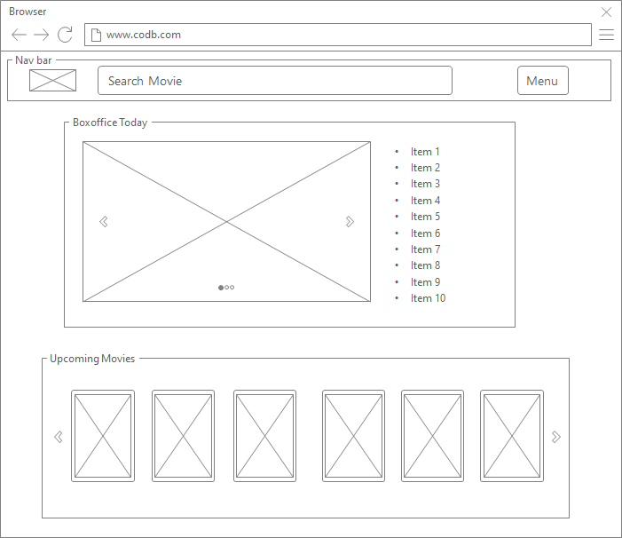

# 설계

 

## ERD Diagram 설계

- 프로젝트 개발에 착수하기 전, 설계했던 **ERD Diagram**이다.

- 사용자, 리뷰글, 댓글, 좋아요를 표시한 영화 등에 대해서 연결된 모델이다.

 

## Wire Frame 화면 설계

- 프로젝트를 개발하며 실제 간단한 Wire Frame 설계 단계를 진행했었다.

- 위의 Wire Frame을 보다 구체적으로 작성해보고자 한다.
  - **'파워목업'** 툴로 이용해 그림 메인 페이지의 Wire Frame 설계이다.

