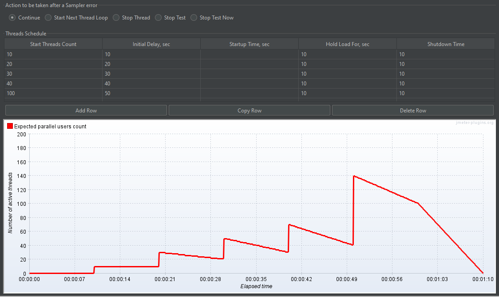
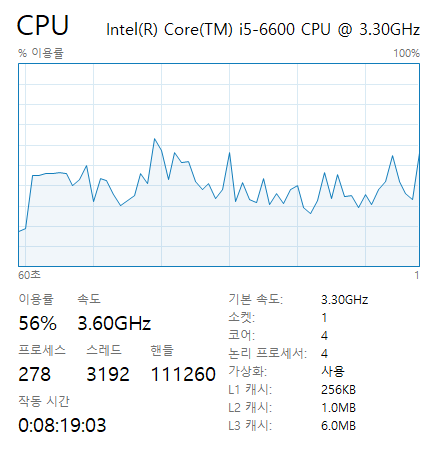
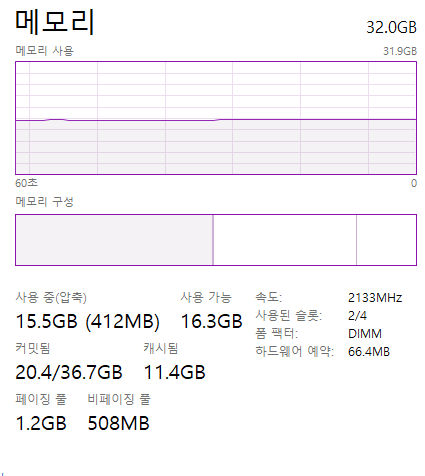
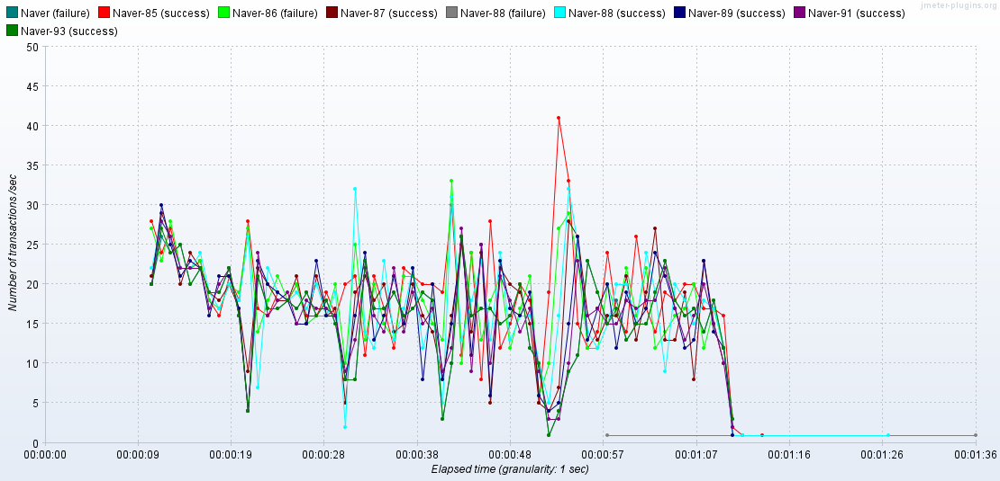
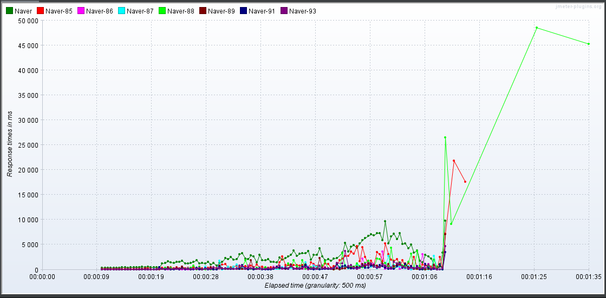

# 산출물

Naver에서 SSAFY를 검색했을 때

- 대상 시스템의 개략적인 한계 부하(TPS) 측정 결과
  - 설정 값
    - 
  - 한계 부하 당시의 CPU, MEM 점유율(스크린샷)
    - 
    - 
  - 한계부하 기술
    - 40TPS
- 한계 부하 발생후의 그래프
  - TPS그래프
    - 
  - 응답속도 그래프
    - 
  - 유저 쓰레드 그래프 
    - 

