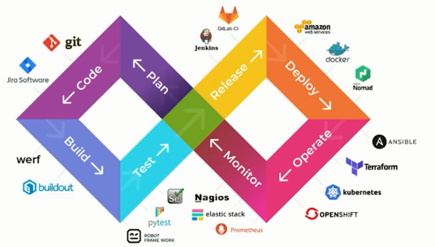
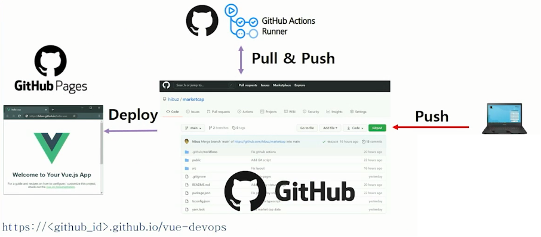

# Vue CLI 프로젝트 기반 DevOps 개발환경 실습
> :bulb: Vue CLI로 프로젝트를 생성하여 GitHub Pages에 정적 페이지 호스팅 하기 & GitHub Actions로 자동 배포 설정해서 DevOps 개발환경을 구성하는 실습하기

## 목표
- Vue.js로 사용한 프로젝트가 어떻게 개발되어 운영에 배포되는 과정을 이해
- 기본적인 프로젝트 구조를 빠르게 스케폴딩 할 수 있는 공식 CLI를 사용하여 정적 페이지를 호스팅 및 배포
- 커밋 & 푸시만으로 자동화 할 수 있는 워크플로우를 구성하여 배포 자동화를 완료

## DevOps

- 개발(Development)과 운영(operations)이 합쳐딘 단어
- 애플리케이션과 서비스를 빠른 속도로 제공할 수 있도록 조직의 역량을 향상시키는 문화 철학, 방식 및 도구의 조합

## 전체 구성도

- 간단한 실습을 위해 전체적인 구성도이다.
  - 타 툴들과의 연동 과정을 생략
  - GitHub에서 제공하는 Saas형 서비스로 일괄 구성을 통해 쉽게 운영이 가능

## JAM Stack

- JAM Stack은 **Javascript, API, Markup** 만으로 이루어진 웹의 구성을 뜻한다.
- 어떤 특정 기술로 구성된 형태를 뜻하는 것이 아닌 이들을 이용해서 **웹 사이트를 어떻게 구성할 것인지의 관점에 초점**을 둔다.
  - **Javascript** : Client의 모든 처리는 Javascript에게 맞긴다.
  - **API** : 모든 기능 및 비즈니스 로직은 재사용 가능한 API로 추상화한다.
  - **Markup** : SSG(Static Site Generator), Template Engine (Webpack 등)을 이용하여 Markup을 미리 생성한다.
- 즉, 사이트를 하나 만드는데 신경쓸것들이 무수히 많기에, 프론트엔드 개발에 보다 집중가능할 수 있도록 하는 구조라고 생각된다.

## 참고자료
- https://aws.amazon.com/ko/devops/what-is-devops/
- https://pks2974.medium.com/jam-stack-%EA%B0%9C%EB%85%90-%EC%A0%95%EB%A6%AC%ED%95%98%EA%B8%B0-17dd5c34edf7
- https://ppsu.tistory.com/72

## 과제제출
- [기본과제](기본과제)
- [심화과제](심화과제)

